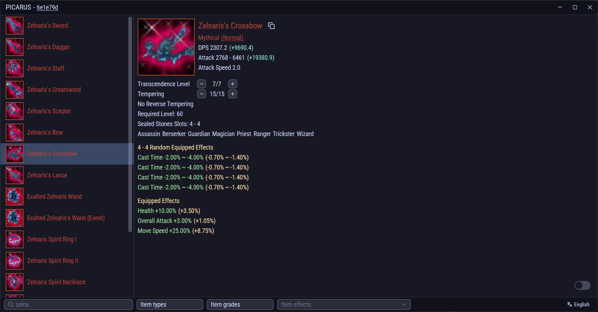

[Download Latest Release](https://github.com/VladTheJunior/picarus/releases/latest/download/picarus.zip)

[English](./README.en.md) | [Русский](./README.md)

    

## Description
Interactive Item Viewer for Riders of Icarus is a desktop application that allows players to browse and search through game items by reading client files directly on the user's machine. The viewer provides fast access to item data with comprehensive filtering capabilities and interactive simulation features.

## Current Features
- Item Categories: Weapons, Secondary Weapons, Armors, Jewelry
- Detailed Information:
  - Basic stats (attack, defense, etc.)
  - Item grade and quality
- Icons
- Effects (random, fixed, and set bonuses)
- Filter System:
  - Multi-language search
  - Grade type filter
  - Item type filter
  - Specific effect filter

## Interactive Systems
- **Random Effects Selection:** Browse and select from all possible random effects that can roll on items
- **Tempering System:** Simulate item tempering to see stat increases at different tempering levels
- **Transdense System:** Explore the transdense enhancement system and its effects on item stats

## Planned Features
- Mounts support
- Seal stones support
- Additional item categories