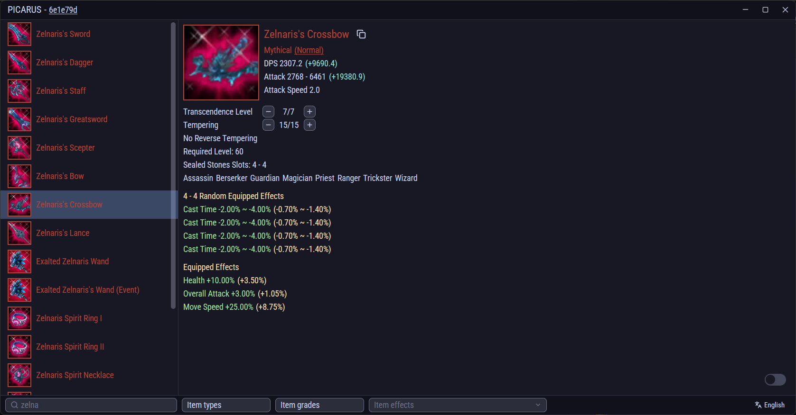
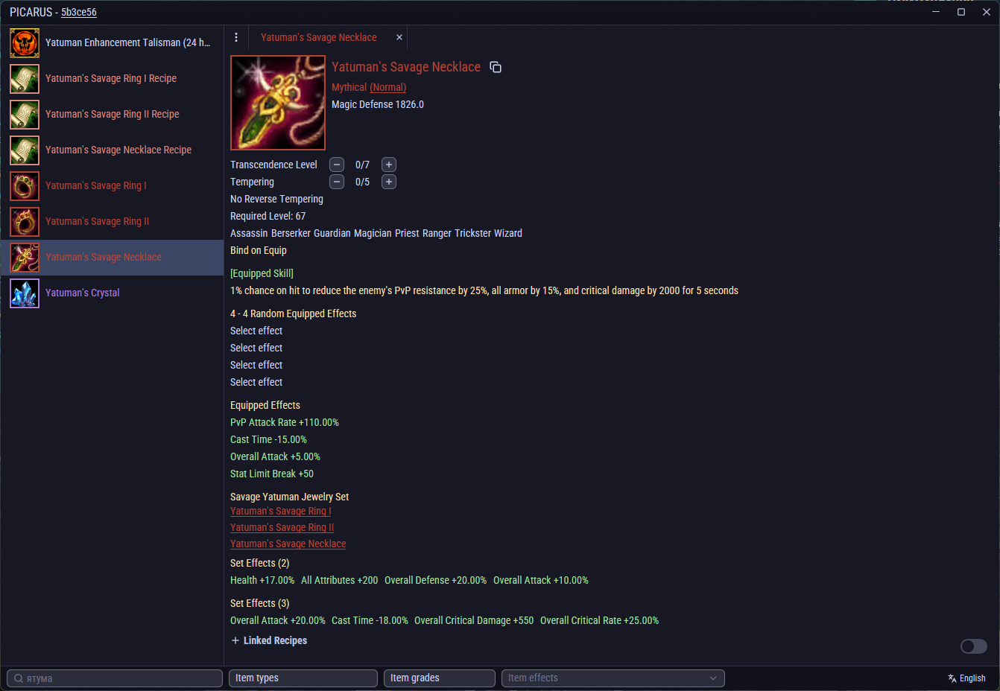
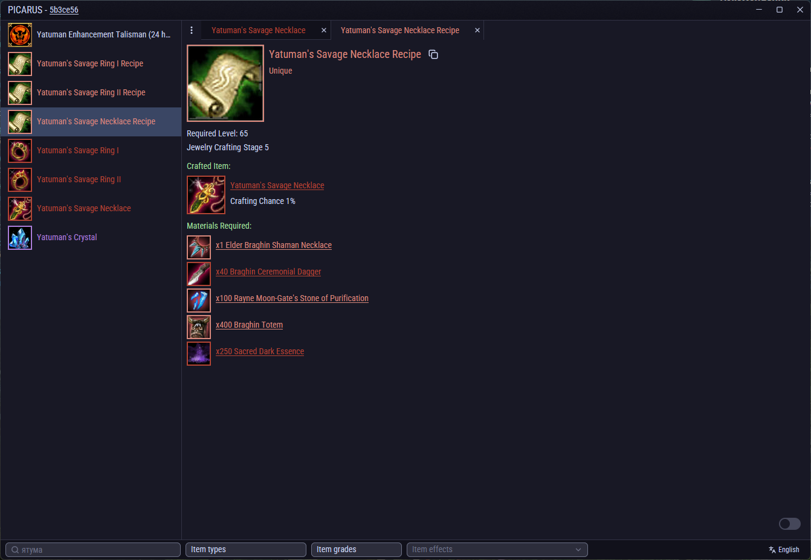

[Download Latest Release](https://github.com/VladTheJunior/picarus/releases/latest/download/picarus.zip)

[English](./README.en.md) | [Русский](./README.md)

     

## Description
Interactive Item Viewer for Riders of Icarus is a desktop application that allows players to browse and search through game items by reading client files directly on the user's machine. The viewer provides fast access to item data with comprehensive filtering capabilities and interactive simulation features.

## Current Features
- Item Categories: 
  - Weapons
  - Secondary Weapons
  - Armors
  - Jewelry
  - Materials
  - Recipes (with crafting chance in percents!!!)
  - Sealed Familiars
  - Gems
  - Skill Books
  - Consumes
  - Boosts
  - Familiar Equips
  - Random Boxes (with drop chance in percents!!!)
  - Packages
  - Accessories
  - Bags
  - Familiar Skins
  - Familiar Consumes
  - Quest Items
  - Bracelets
  - Relics
  - Familiars
- Detailed Information:
  - Basic stats (attack, defense, etc.)
  - Item grade and quality
  - Linked recipes
- Icons
- Effects (random, fixed, and set bonuses)
- Filter System:
  - Multi-language search
  - Grade type filter
  - Item type filter
  - Specific effect filter
  - Drop chance from fishing
  - Evolution chances
  - Synthesis chances

## Interactive Systems
- **Random Effects Selection:** Browse and select from all possible random effects that can roll on items
- **Tempering System:** Simulate item tempering to see stat increases at different tempering levels
- **Transdense System:** Explore the transdense enhancement system and its effects on item stats
- **Item Quality Selection:** Simulation of item quality and its impact on stats

## Planned Features
- Mounts support
- Drop list support (with drop chance)

## Known Limitations
- Some character equipments stats (phys. defense, attack) may different from what game shows
- Sealed stones stats may different from what game shows