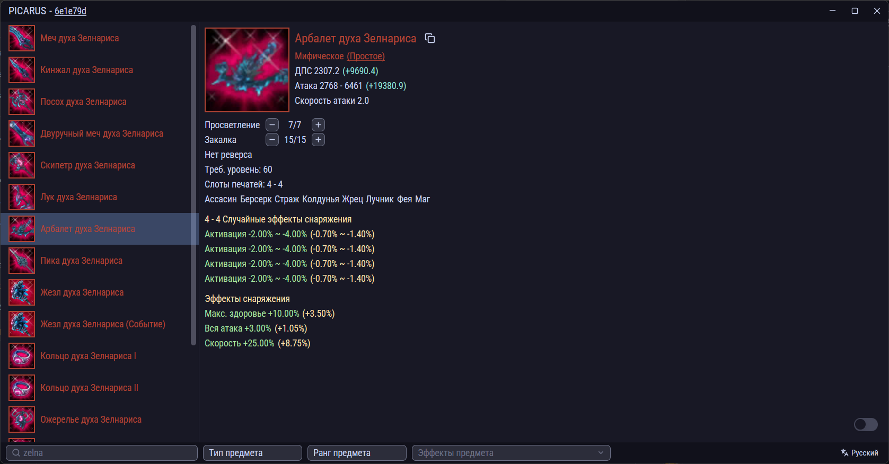
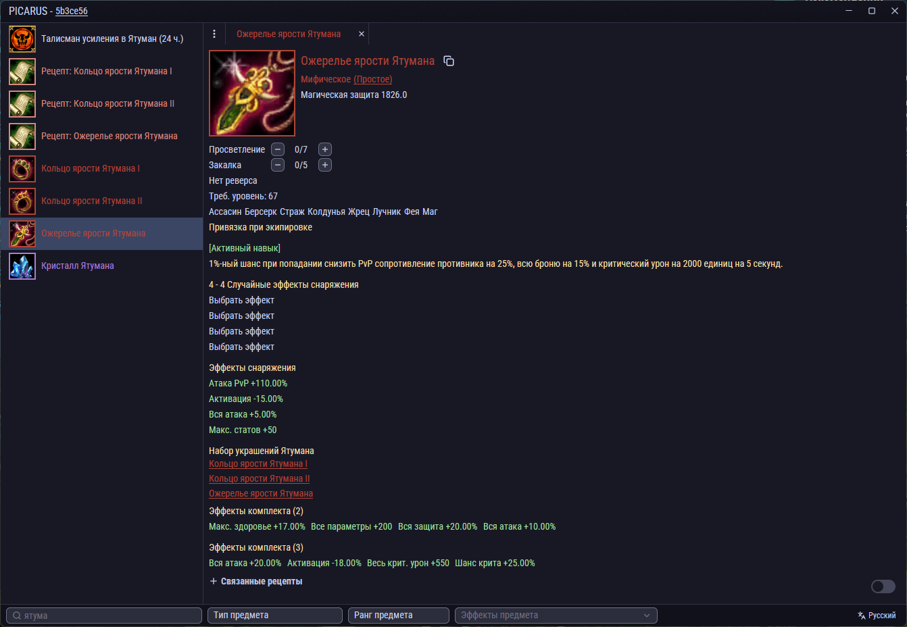
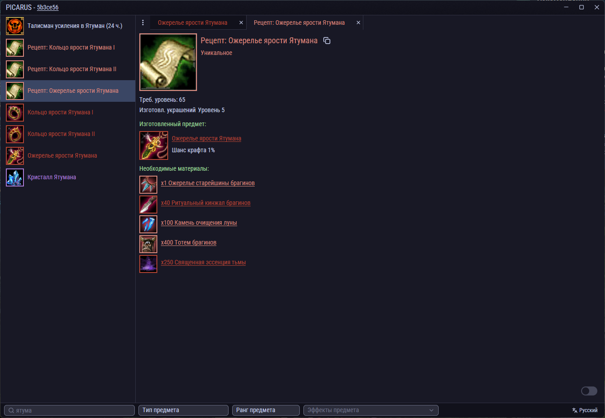

[Скачать последний релиз](https://github.com/VladTheJunior/picarus/releases/latest/download/picarus.zip)

[English](./README.en.md) | [Русский](./README.md)

     

## Описание
Интерактивный просмотрщик предметов для Riders of Icarus - это приложение, которое позволяет игрокам просматривать и искать игровые предметы, напрямую из файлов клиента непосредственно на компьютере пользователя. Обеспечивает быстрый доступ к данным предметов с фильтрацией и интерактивными функциями.

## Текущие возможности
- Категории предметов:
  - Оружие
  - Второе оружие
  - Доспехи
  - Украшения
  - Материалы
  - Рецепты (с шансом крафта в процентах!!!)
  - Снаряжение спутников
  - Расходники
  - Усиления
  - Самоцветы
  - Запечатанные спутники
  - Книги навыков
  - Валюта
  - Случайные сундуки (с шансом выпадения предметов!!!)
  - Запечатанные предметы
  - Аксессуары
  - Сумки
  - Облики спутников
  - Расходники спутников
  - Квестовые предметы
  - Браслеты
  - Реликвии
  - Спутники
- Детальная информация:
  - Основные характеристики (атака, защита и т.д.)
  - Редкость и качество предмета
  - Связанные рецепты
- Иконки
- Эффекты (случайные, фиксированные и бонусы от комплекта)
- Система фильтров:
  - Мультиязычный поиск
  - Фильтр по редкости
  - Фильтр по типу предмета
  - Фильтр по конкретному эффекту
- Шансы дропы с рыбалки
- Шансы эволюции спунтников
- Шансы синтеза спунтников

## Интерактивные системы
- **Выбор случайных эффектов:** Просмотр и выбор всех возможных случайных эффектов, которые могут выпасть на предметах
- **Система закалки:** Симуляция закалки предмета для просмотра увеличения характеристик на разных уровнях закалки
- **Система просветления:** Симуляция просветления и её влияния на характеристики предметов
- **Выбор качества предмета:** Симуляция качества предмета и его влияния на характеристики

## Запланированные функции
- Поддержка маунтов
- Поддержка дроп листа (с шансом дропа)

## Известные ограничения
- Статы некоторого снаряжения (атака, физ. защита) могут ненамного отличаться от того, что показывает игра
- Статы запечатанных спутников могут ненамного отличаться от того, что показывает игра