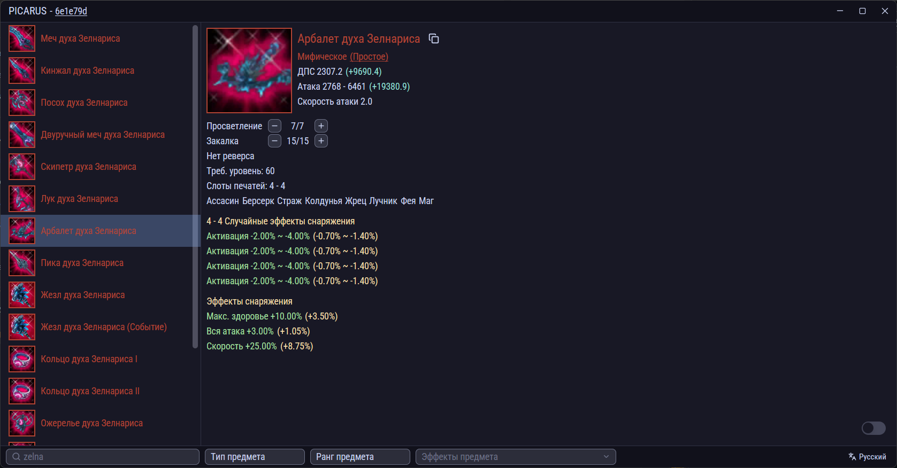

### Выберите язык:
[English](./README.md) | [Русский](./README.ru.md)

## Описание
Интерактивный просмотрщик предметов для Riders of Icarus - это приложение, которое позволяет игрокам просматривать и искать игровые предметы, напрямую из файлов клиента непосредственно на компьютере пользователя. Обеспечивает быстрый доступ к данным предметов с фильтрацией и интерактивными функциями.

## Текущие возможности
- Категории предметов: Оружие, Вторичное оружие, Броня, Украшения
- Детальная информация:
  - Основные характеристики (атака, защита и т.д.)
  - Редкость и качество предмета
- Иконки
- Эффекты (случайные, фиксированные и бонусы от комплекта)
- Система фильтров:
  - Мультиязычный поиск
  - Фильтр по редкости
  - Фильтр по типу предмета
  - Фильтр по конкретному эффекту

## Интерактивные системы
- **Выбор случайных эффектов:** Просмотр и выбор всех возможных случайных эффектов, которые могут выпасть на предметах
- **Система закалки:** Симуляция закалки предмета для просмотра увеличения характеристик на разных уровнях закалки
- **Система просветления:** Симуляция просветления и её влияния на характеристики предметов

## Запланированные функции
- Поддержка маунтов
- Поддержка камней печати
- Дополнительные категории предметов